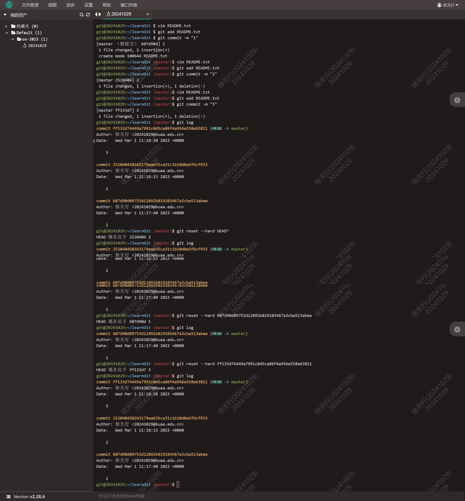
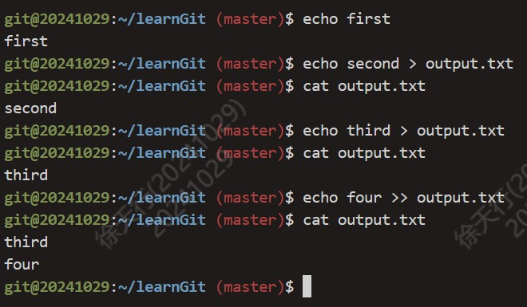

<h1 align="center">Lab0实验报告</h1>

## 1. 思考题

### Thinking0.1

不一样。

第一次执行add指令之前，尚未追踪文件的变化。README.txt中添加任意内容并使用add指令后，添加至暂存区；再使用commit指令，提交至储存库。

再次修改README.txt，在未使用add指令之前，文件尚未提交到暂存区。

### Thinking0.2

add the file：git add

stage the file：git dd

commit：git commit

### Thinking0.3

1. git checkout printf.c

2. git reset HEAD printf.c

	git checkout printf.c

3. git rm --cached Tucao.txt

### Thinking0.4



### Thinking0.5



### Thinking0.6

command 文件内容如下：

```
echo 'echo Shell Start...' > test.sh
echo 'echo set a = 1' >> test.sh
echo 'a=1' >> test.sh
echo 'echo set b = 2' >> test.sh
echo 'b=2' >> test.sh
echo 'echo set c = a+b' >> test.sh
echo 'c=$[$a+$b]' >> test.sh
echo 'echo save c to ./file1' >> test.sh
echo 'echo $c>file1' >> test.sh
echo 'echo save b to ./file2' >> test.sh
echo 'echo $b>file2' >> test.sh
echo 'echo save a to ./file3' >> test.sh
echo 'echo $a>file3' >> test.sh
echo 'echo save file1 file2 file3 to file4' >> test.sh
echo 'cat file1>file4' >> test.sh
echo 'cat file2>>file4' >> test.sh
echo 'cat file3>>file4' >> test.sh
echo 'echo save file4 to ./result' >> test.sh
echo 'cat file4>>result' >> test.sh
```

result 文件内容为：

```
Shell Start...
set a = 1
set b = 2
set c = a+b
save c to ./file1
save b to ./file2
save a to ./file3
save file1 file2 file3 to file4
save file4 to ./result
3
2
1
```

`echo echo Shell Start` 与 `echo 'echo Shell Start'`效果一样

`echo echo \$c>file1` 与 `echo 'echo \$c>file1'`效果不一样。

执行test时，将结果重定向至result，故result中前面部分为test输出；test最终将a、b、c的值通过>>添加到result中。

## 难点

本次实验内容主要是Linux下各工具的使用，主要难点在于命令及其参数较多，不易记忆。

Shell脚本的编写注意点较多，和之前学习的编程语言有较大差异，实践过程中犯了很多小错误。

## 感想

对于这次实验，我认为最重要的是学会自己查询学习各种命令的使用，通过man指令打开帮助手册进行查找学习。
