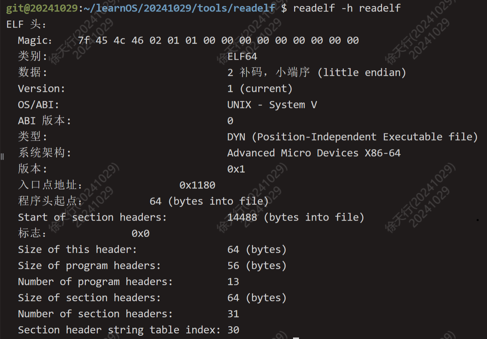
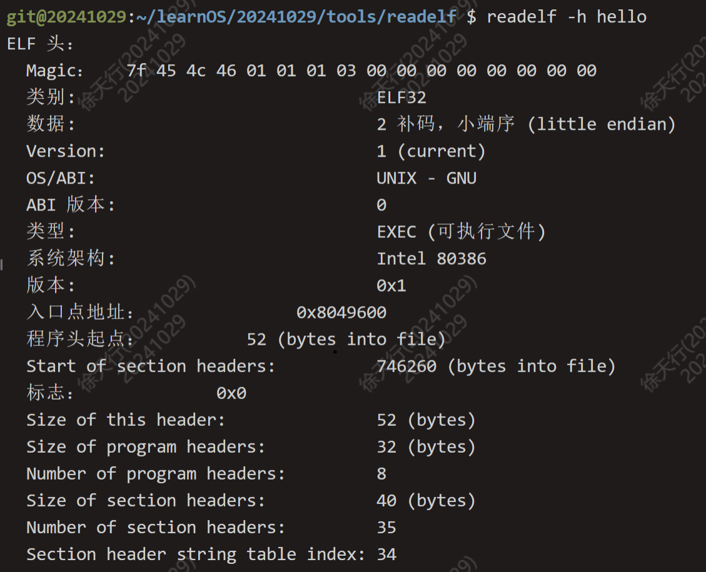
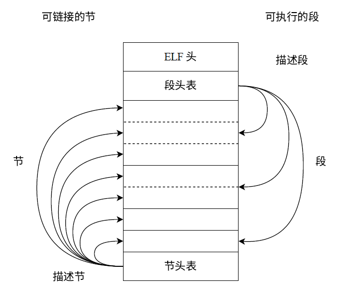
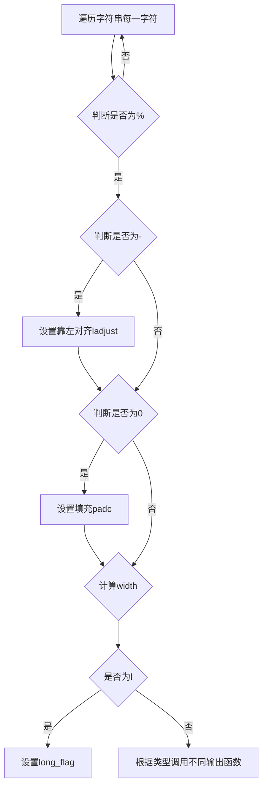

<h1 align="center">Lab1实验报告</h1>

## 思考题

### Thinking1.1

使用原生x86 工具链时，编译命令为：`gcc -o targetFile sourceFile1 sourceFile2 ...`

反汇编命令为：`objdump -DS 要反汇编的目标文件名> 导出文本文件名`

使用MIPS交叉编译工具链时，编译命令为：`mips-linux-gnu-gcc -o targetFile sourceFile1 sourceFile2 ...`

反汇编命令为：`mips-linux-gnu-objdump -DS 要反汇编的目标文件名> 导出文本文件名`

-D表示： Display assembler contents of all sections，即反汇编所有节的内容并展示。

-S表示：Intermix source code with disassembly，即将源代码与反汇编混合，尽可能反汇编出源代码

### Thinking1.2

通过使用`readelf -h`进行解析

readelf是64位程序而hello是32位程序，自己编写的 readelf 只能对32位程序进行解析，因此无法解析readelf

### Thinking1.3

在真实的计算机启动时，无法直接加载ELF格式内核，必须从电启动地址开始，先运行bootloader，在加载内核运行。

在GXemul 仿真器上，可以直接加载ELF格式的内核，因此不需要bootloader，直接跳转到内核的入口即可。

## 难点

1. 理解ELF文件的结构

ELF文件起始为ELF头，通过解析ELF头，可以获取ELF文件的格式信息，并可以获取节头表和段头表的位置（相对文件的偏移量offset），以及节头表和段头表每一项的大小。

根据节头表的信息，可以依次读取程序中各个节的信息。

2. vprintfmt的实现。

要补充完整vprintfmt函数，需要了解传入的参数，其所需调用的函数等，需要翻看相应代码。

大致过程如下：

## 感想

通过实验，我对 ELF 文件的格式有了了解，对内核的启动有了更深的理解，通过自己实现vprintfmt函数，对于格式化输出有了进一步体会。

在完成本次实验的过程中，我发现除了需要阅读指导书外，还需要阅读实验的代码，不止要学会写代码，更要学会阅读、学习代码。
