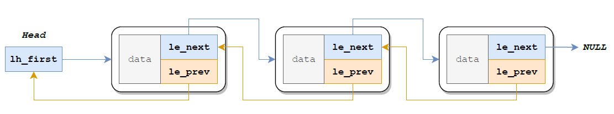

# Lab2总结

## 1. 常用工具宏、函数

- `PDX(va) `：页目录偏移量（查找遍历页表时常用） 
- `PTX(va)` ：页表偏移量（查找遍历页表时常用） 
- `PTE_ADDR(pte) `：获取页表项中的物理地址（读取 pte 时常用） 
- `PADDR(kva) `：kseg0 处虚地址→物理地址 
- `KADDR(pa)` ：物理地址 kseg0 处虚地址（读取 pte 后可进行转换） 
- `va2pa(Pde *pgdir, u_long va) `：查页表，虚地址→物理地址（测试时常用） 
- `pa2page(u_long pa) `：物理地址→页控制块（读取 pte 后可进行转换） 
- `page2pa(struct Page *pp) `：页控制块→物理地址（填充 pte 时常用）

## 2. Lab2相关函数

### 1. 初始化内存管理相关数据结构

调用以下3个函数完成初始化工作：

- `mips_detect_memory()`：获取内存大小，计算物理页的数量。

- `mips_vm_init()`：调用`alloc()`分配空间建立一个数组`pages`，大小为物理页的数量，其中的每个元素类型为`struct Page`，对应一个物理页，用于管理页。

	- `alloc()`：分配指定大小内存，通过该函数分配的内存不会被OS管理，只有在初始化内存管理时在`mips_vm_init()`调用。

	- `struct Page`结构如下：

		```C
		struct Page {
			Page_LIST_entry_t pp_link; // 用于建立空闲页链表，从而进行内存分配、回收
			u_short pp_ref; // 这一页物理内存被引用的次数，它等于有多少虚拟页映射到该物理页。对于空闲页，其值应为0
		};
		```

- `page_init()`：在物理内存管理中介绍。

### 2. 链表宏

链表宏实现了一个双向链表，但与常规双向链表有所区别，只可顺序遍历，使用两个指针目的在于：便于删除元素、在指定位置前插入元素。

图示如下：



### 3. 物理内存管理

 物理内存管理有以下几个函数。

- `page_init()`：使用宏`LIST_INIT`初始化空闲页链表`page_free_list`，将地址按页大小对齐。`mips_vm_init()`中直接操作物理地址获取空间，为将这部分空间也纳入页式内存管理，故将已使用的空间对应的页控制块`pp_ref`加1。剩下的物理页面无虚拟页映射，故引用次数置0，并将其插入空闲页链表。
- `page_alloc()`：分配一个空闲物理页，从空闲页链表`page_free_list`头部获取页面并将其移出链表，需清空分配的物理页（置0）。
- `page_decref()`：将指定页的`pp_ref`减1，即映射到该物理页的虚拟页数量减1。`pp_ref`为0则调用`page_free()`
- `page_free()`：将页面重新添加至空闲页链表`page_free_list`

### 4. 虚拟内存管理

虚拟内存管理有以下几个函数。

- `pgdir_walk()`：
	- 该函数类似于`va2pa()`函数，二者都使用二级页表寻址，区别在于：`pgdir_walk()`获取的是**二级页表项**的地址，因此意味着之后可以对页表项进行修改，改变虚拟地址映射到的物理地址，或者更改其权限位；而`va2pa()`获取的是虚拟地址对应的物理地址。
	- 在调用函数时，当`create`参数传入值为1，且对于传入虚拟地址尚未建立页目录到页表的映射时，会调用`page_alloc()`分配空闲页面来创建页表。
	- 大致流程：查询页目录，获取页表物理地址，若页表物理地址无效且`create`参数传入值为1，调用`page_alloc()`分配空闲页面来创建页表。根据页表物理地址，先将其转换为虚拟地址，再加上页表内偏移获取到页表项地址。
- `page_insert()`：将指定虚拟地址映射到指定物理地址，并设置为指定权限。
	- 大致流程：调用`pgdir_walk()`判断是否已有映射关系，若已有映射关系，则判断是否符合要求，不符合要求则调用`page_remove()`删除映射关系；符合要求则设置权限位并退出函数。再次调用`pgdir_walk()`，创建二级页表并获取到二级页表项的地址，将二级页表项中的物理地址设置为指定物理地址并设置权限位。
	- 注：由于修改了映射关系，必须调用`tlb_invalidate()`清空TLB中相应缓存。
- `struct Page* page_lookup(Pde *pgdir, u_long va, Pte **ppte)`：返回一级页表基地址pgdir 对应的两级页表结构中虚拟地址va 映射的物理页面的页控制块，同时将
	ppte 指向的空间设为对应的二级页表项地址。
- `page_remove()`：删除指定虚拟地址到物理地址的映射。如果存在这样的映射，那么对应物理页面（页表）的引用次数会减少一次。