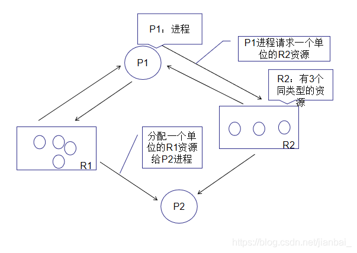

# 4. 死锁

## 4.1 死锁的概念

### 4.1.1 死锁的定义

死锁是指多个进程因竞争资源而造成的一种僵局（相互等待），若无外力作用，这些进程将无法向前推进。

### 4.1.2 死锁产生的原因

- 竞争资源
- 并发执行的顺序不当

资源死锁：每个进程等待的事件是释放该进程集合中其他进程所占有的资源。

通讯死锁：进程 A 给进程 B 发了一条消息，然后进程 A 阻塞直到进程 B 返回响应。假设请求消息丢失了，那么进程 A 在一直等着回复，进程 B 也会阻塞等待请求消息到来，这时候就产生死锁。

对于通讯死锁来所，不存在资源的占用，难以通过调度避免，但可以可以通过超时机制避免。

### 4.1.2 活锁

活锁是指两个以上的线程在执行的时候，因为相互谦让资源，结果都拿不到资源，没法运行程序。

如：两个线程如果同时解锁，重试时同时加锁，不断循环。

想要避免活锁发生，可以在解锁之前，等待一个随机时间。

### 4.1.3 死锁产生的必要条件

- **互斥条件**：进程对所分配到的资源进行排它性使用，即在一段时间内某资源只能有一个进程占用。
- **不可剥夺条件**：进程已获得的资源，在未使用完之前不能被强制剥夺，只能在使用完时由自己释放。
- **请求保持条件**：已经获得资源的线程可以请求新的资源。
- **循环等待条件**：在发生死锁时，必然存在两个或多个进程组成的环形链，每个进程都在等待环形链中下一个节点占用的资源。例如，进程集合 $\{P_0,P_1,P_2,\dots,P_n\}$ 中的
	$P_0$ 正在等待 $P_1$ 占用的资源；$P_1$ 正在等待 $P_2$ 占用的资源，……，$P_n$ 正在等待已被 $P_0$ 占用的资源。

## 4.2 处理死锁的基本方法

### 4.2.1 鸵鸟算法

鸵鸟算法即无所作为，无视死锁。

如果死锁发生概率小、影响低时，可以考虑不处理死锁。

### 4.2.2 死锁检测与解除

#### 1. 死锁检测的算法

根据资源的请求和分配信息，利用某种算法对这些信息加以检查，以判断是否存在死锁。死锁检测算法主要是检查是否有循环等待。

##### (1) 资源分配图

用圆圈表示一个进程；方框代表一类资源，方框中的一个圆代表一类资源中的一个资源；从进程到资源的有向边称为请求边，表示该进程申请一个单位的该类资源；从资源到进程的有向边称为分配边，表示该类资源已有一个资源分配给了该进程。

**封锁进程**：指某个进程由于请求了超过了系统中现有的未分配资源数目的资源，而被系统封锁的进程。

**非封锁进程**：没有被系统封锁的进程。

**资源分配图的化简方法**：：假设某个资源分配图中存在一个进程 $P_i$，此刻 $P_i$ 是非封锁进程，那么可以进行如下化简：

识别空闲资源，当 $P_i$ 对空闲资源有请求边时，首先将其请求边变成分配边(即满足Pi的资源请求)，而一旦 $P_i$ 的所有资源请求都得到满足，$P_i$ 就能在有限的时间内运行结束，并释放其所占用的全部资源，此时 $P_i$ 只有分配边，
删去这些分配边（实际上相当于消去了 $P_i$ 的所有请求边和分配边），使 $P_i$ 成为孤立结点。（反复进行）

在经过一系列的简化后，若能消去图中的所有边
，使所有的进程都成为孤立结点，则称该图是**可完全化简**的；反之的是**不可完全化简**的。

**死锁定理**：系统中某个时刻 $t$ 为死锁状态的充要条件是 $t$ 时刻系统的资源分配图是不可完全化简的。

##### (2) 资源向量（矩阵）法

**存在资源向量 E**：表示各类资源存在的总量。
$$
E=(E_1,E_2,\dots,E_m)
$$
**可用资源向量 A**：表示当前未分配可使用的资源数。
$$
A=(A_1,A_2,\dots,A_m)
$$
**当前分配矩阵 C**：第 $i$ 个行向量对应第 $i$ 个进程已经分配到的各类资源数量。
$$
\begin{bmatrix}
C_{11}&C_{12}&C{13}&\cdots&C_{1m}\\
C_{21}&C_{22}&C{23}&\cdots&C_{2m}\\
\vdots&\vdots&\vdots&\ddots&\vdots\\
C_{n1}&C_{n2}&C{n3}&\cdots&C_{nm}
\end{bmatrix}
$$
**请求矩阵 R**：第 $i$ 个行向量表示进程 $i$ 所需要的资源数量。
$$
\begin{bmatrix}
R_{11}&R_{12}&R{13}&\cdots&R_{1m}\\
R_{21}&R_{22}&R{23}&\cdots&R_{2m}\\
\vdots&\vdots&\vdots&\ddots&\vdots\\
R_{n1}&R_{n2}&R{n3}&\cdots&R_{nm}
\end{bmatrix}
$$
恒等式：$\sum_{i=1}^nC_{ij}+A_j=E_j$

算法内容：

- 寻找进程 $P_i$，其在 $R$ 矩阵中对应的第 $i$ 行小于等于 $A$。
- 如果找到，将 $C$ 矩阵的第 $i$ 行加入 $A$，标记该进程执行完毕，转到第 $1$ 步。
- 如果找不到，结束。

算法结束时，如存在未标记进程，则他们为死锁进程。

#### 2. 死锁恢复

##### (1) 资源抢占法

挂起一些占有资源的进程，剥夺它们的资源以解除死锁，将资源分配给另一个死锁进程使其能够执行完毕，然后再激活被挂起的进程。

##### (2) 杀死进程法

杀死一个或者若干进程，释放其资源，直到打破死循环。

根据资源占有情况，杀死环内进程或者环外进程。

应杀死重新执行无副作用的进程。

##### (3) 回滚法

设置检查点，根据死锁时所需要的资源，将一个拥有资源的进程滚回到一个未占用资源的检查点状态，从而使得其他死锁进程能够获得相应的资源。

## 4.3 死锁预防

防止死锁发生只需破坏死锁产生的四个必要条件之一。

### 1. 破坏互斥条件

允许进程同时访问某些资源。

但是，有的资源是不允许被同时访问的，所以破坏互斥条件预防死锁一般不可行。

### 2. 破坏不可剥夺条件

允许进程强行从占有者那里夺取某些资源。

由于资源的独占特性，这种预防死锁的方法实现起来困难。

### 3. 破坏保持和请求条件

在进程开始执行前请求所需的全部资源。只有当系统能够满足当前进程的全部资源需求时，才一次性地将所申请的资源全部分配给该进程，否则不分配任何资源。

缺点：

- 由于进程在执行时是动态的，**不可预测**的，因此不可能知道它所需要的全部资源。
- **资源利用率低**。无论资源何时用到，一个进程只有在占有所需的全部资源后才能执行。即使有些资源最后才被用到一次，但该进程在生存期间却一直占有。这显然是一种极大的资源浪费。
- **降低进程的并发性**。因为资源有限，又加上存在浪费，能分配到所需全部资源的进程个数就必然少了。

### 4. 破坏循环等待条件

实行资源有序分配策略。即把资源事先分类编号，所有进程对资源的请求必须严格按资源序号递增的顺序提出，使进程在申请，占用资源时不会形成环路，从而预防了死锁。

缺点：

- 限制了进程对资源的请求，同时给系统中所有资源合理编号也很困难，并增加了系统开销。
- 为了遵循按编号申请的次序，暂不使用的资源也需要提前申请，从而增加了进程对资源的占用时间。

## 4.4 死锁避免

死锁的避免是排除死锁的动态策略，它不限制进程有关资源的申请，而是对进程所发出的每一个申请资源命令加以动态地检查，并根据检查结果决定是否进行资源分配。

### 4.4.1 安全序列

安全序列时指系统中的所有进程能够按照某一种次序分配资源，并且依次地运行完毕，
这种进程序列 $\{P_1,P_2,\dots,P_n\}$ 就是安全序列。

如果存在这样一个安全序列，则系统是安全的；
如果系统不存在这样一个安全序列，则系统是不安全的。

### 4.4.2 安全状态

**安全状态**：如果当前状态没有死锁发生，并且即使所有进程突然请求对资源的最大需求，也仍然存在某种调度次序能够使得每一个进程运行完毕，则
称该状态是安全状态。

**不安全状态**：不存在可完成的序列使进程运行完毕。

系统进入不安全状态（四个死锁的必要条件同时发生）也未必会产生死锁。但产生死锁后，
系统一定处于不安全状态。

### 4.4.3 银行家算法

#### 1. 相关数据结构

**可利用资源向量 Available**：

⼀个含有 $m$ 个元素的向量，其中每⼀个元素代表⼀类可利用的资源数目，其初值是系统中所配置的该类全部可用资源数目。如果$Available[j]=k$，表示系统中现有 $R_j$ 类资源 $k$ 个。

**最⼤需求矩阵 Max**：

⼀个 $n\times m$ 的矩阵，定义了系统中 $n$ 个进程中的每⼀个进程对 $m$ 类资源的最大需求。如果
$Max(i,j)=k$，表示进程 $i$ 需要 $R_j$ 类资源的最大数目为 $k$
。

**分配矩阵 Allocation**：

⼀个 $n\times m$ 的矩阵，定义了系统中每一类资源当前已分配给每⼀进程的资源数。如果
$Allocation(i,j)=k$，表示进程 $i$ 当前已分得 $R_j$ 类资源 $k$
个。

**需求矩阵 Need**：

⼀个 $n\times m$ 的矩阵，表示每⼀个进程尚需的各类资源数。如果 $Need(i,j)=k$，表示进程 $i$ 还需要 $R_j$ 类资源 $k$ 个，方能完成其任务。
$$
Need(i,j)= Max(i,j)-Allocation(i,j)
$$

#### 2. 算法内容

设 $Request_i$ 是进程 $P_i$ 的请求向量，如果进程 $P_i$ 需要 $K$ 个 $R_j$ 类资源，当 $P_i$ 发出资源请求后，系统按下述步骤进行检查：

1. 如果 $Request_i\le Need_i$，则转向步骤 2；否则认为出错。
	（因为它所需要的资源数已超过它所宣布的最大值）

2. 如果 $Request_i\le Available$，则转向步骤3；否则，表示系统中尚无足够的资源，$P_i$ 必须等待。

3. 系统试探把要求的资源分配给进程 $P_i$，并修改下面数据结构中的数值：
	$$
	Available:=Available-Request_i;\\
	Allocation_i:=Allocation_i+Request_i;\\
	Need_i:= Need_i- Request_i;
	$$

4. 系统执行**安全性算法**，检查此次资源分配后，系统是否处于安全状态。若安全，正式将资源分配给进程 $P_i$，以完成本次分配；否则，将试探分配作废，恢复原来的资源分配状态，让进程 $P_i$ 等待。

#### 3. 安全性算法

系统所执行的安全性算法可描述如下：

1. 设置两个向量:

	- **工作向量 Work**：表示系统可提供给进程继续运行所需要的各类资源的数目， 它含有 $m$ 个元素， 执行安全算法开始时，
		$Work:=Available$。
	- **Finish**：它表示系统是否有足够的资源分配给进程，使之运行完成。
		开始时初始化 $Finish[i]:=false$；当有足够的资源分配给进程 $i$ 时，
		令 $Finish[i]:=true$，表示进程获得资源并执行完毕。

2. 从进程集合中找到⼀个能满足下述条件的进程：

	- $Finish[i]=false$
	- $Need_i\le Work$

	如找到，执行步骤 3；否则执行步骤 4。

3. 当进程 $P_i$ 获得资源后，可顺利执行，直至完成，并释放出分配给它的资源，故执行：
	$$
	Work:=Work+Allocation_i;\\
	Finish[i]:=true;\\
	Goto\ step2;
	$$

4. 如果所有进程的 $Finish[i]=true$，则表示系统处于安全状态；否则，系统处于不安全状态。

#### 4. 特点

- 允许互斥、部分分配和不可抢占，可提高资源利用率
- 要求事先说明最大资源要求，在现实中不够实用