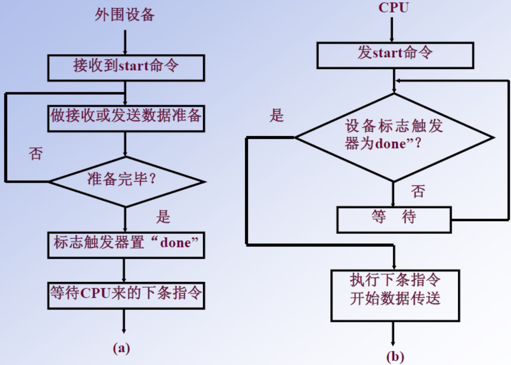
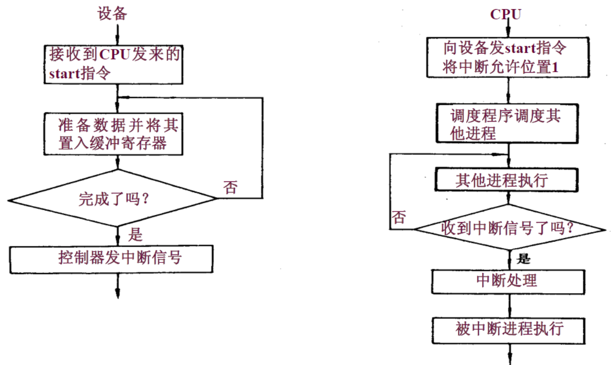
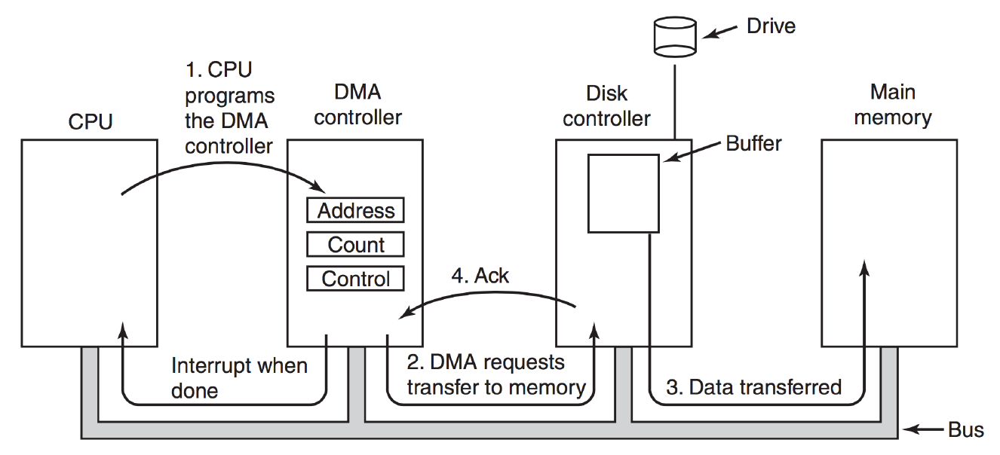
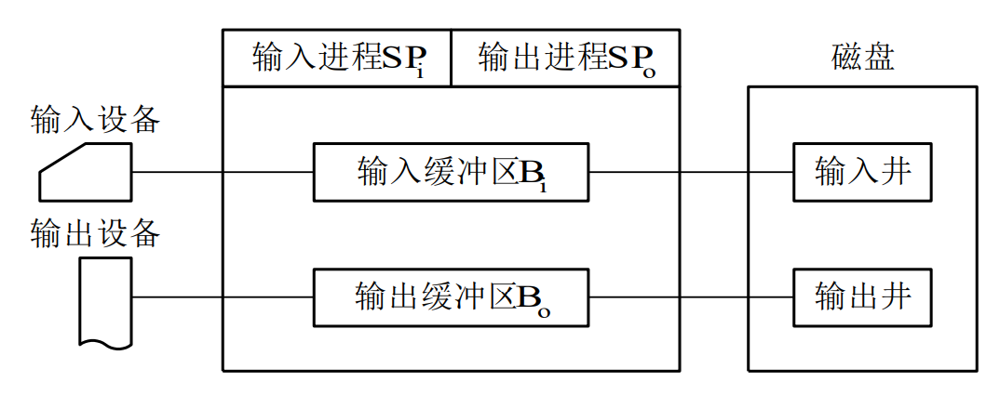

# I/O管理

## 1. I/O管理概述

### 1.1 I/O设备

#### (1) 设备的分类

按信息交换的单位分类，I/O 设备可分为：

- **块设备**：信息交换以数据块为单位。属于有结构设备，如磁盘、CD-ROM、USB盘等。基本特征是传输速率较高、可寻址，即对它可随机读写任意一块。
- **字符设备**：信息交换以字符为单位。属于无结构类型，如交互式终端机、打印机、网卡、鼠标等。基本特征是传输速率低、不可寻址，并且时常采用中断 I/O 方式。

按照传输速率分类，I/O 设备可分为：

- **低速设备**：传输速率仅为每秒几字节到数百字节的一类设备，如键盘、鼠标等。
- **中速设备**：传输速率为每秒数千字节至数万字节的一类设备，如激光打印机等。
- **高速设备**：传输速率在每秒数百千字节至千兆字节的一类设备，如磁盘机、光盘机等。

按照共享属性分类，I/O 设备可分为：

- **独占设备**
- **共享设备**

#### (2) I/O接口

I/O 接口（设备控制器）位于 CPU 与设备之间，它既要与 CPU 通信，又要与设备通信，还要具有按 CPU 发来的命令去控制设备工作的功能，主要由三部分组成：

- **设备控制器与 CPU 的接口**：该接口有三类信号线，数据线、地址线和控制线。数据线通常与两类寄存器相连：数据寄存器（存放从设备送来的输入数据或从 CPU 送来的输出数据）和控制/状态寄存器（存放从 CPU 送来的控制信息或设备的状态信息）
- **设备控制器与设备的接口**：一个设备控制器可以连接一个或多个设备，因此控制器中有一个或多个设备接口。每个接口中都存在数据、控制和状态三种类型的信号。
- **I/O逻辑**：用于实现对设备的控制。它通过一组控制线与 CPU 交互，对从 CPU 收到的 I/O 命令进行译码。CPU 启动设备时，将启动命令发送给控制器，同时通过地址线把地址发送给控制器，由控制器的 I/O 逻辑对地址进行译码，并相应地对所选设备进行控制。

设备控制器地主要功能有：

- 接受和识别 CPU 发来的命令，如磁盘控制器能接收读、写、查找等命令。
- 数据交换，包括设备和控制器之间的数据传输以及控制器和主存之间的数据传输。
- 标识和报告设备的状态，以供 CPU 处理。
- 地址识别
- 数据缓冲
- 差错控制

#### (3) I/O端口

I/O端口是指设备控制器中可被 CPU 直接访问的寄存器，主要有以下三类：

- **数据寄存器**：实现 CPU 和外设之间的数据缓冲。
- **状态寄存器**：获取执行结果和设备的状态信息，以供 CPU 处理。
- **控制寄存器**：由 CPU 写入，以便启动命令或更改设备模式。

CPU 与 I/O 端口通信方式有以下两种：

- **独立编址**：为每个端口分配一个 I/O 端口号，所有的 I/O 端口形成 I/O 端口 空间，普通用户程序不能对其进行访问，只有操作系统程序使用特殊的 I/O 指令才能访问端口。
- **统一编址/内存映射I/O**：控制器的内存/寄存器映射为物理内存空间的一部分，每个端口分配唯一的内存地址，对I/O的操作通过 load 和 store 指令来实现。

### 1.2 I/O 控制方式

外设与内存之间的输入/输出控制方式有以下4种：

#### (1) 程序直接控制方式

I/O 操作由程序发起，并等待操作完成。数据的每次读写通过 CPU。

这种方式在外设未准备好前 CPU 一直处于轮询或者忙等状态。

优点：实现简单

缺点：CPU 利用率低，在外设进行数据处理时，CPU 只能等待，导致 CPU 资源浪费。

#### (2) 中断驱动方式

I/O 操作由程序发起，在操作完成时（如数据可读或已经写入），由外设向 CPU 发出中断，通知该程序。数据的每次读写通过
CPU。

优点：在外设进行数据处理时，CPU 不必等待，可以继续执行该程序或其他程序，提高了 CPU 利用率；可以处理不确定事件。

缺点：每次输入/输出数据都要中断 CPU，多次中断浪费 CPU 时间，只适于数据传输率较低的设备。

#### (3) 直接存储访问方式（DMA）

DMA 流程大致如下：

- 由程序设置 DMA 控制器中的若干寄存器值（如内存始址，传送字节数），然后发起 I/O 操作。
- DMA 控制器完成内存与外设的成批数据交换。
- 在操作完成时由 DMA 控制器向 CPU 发出中断。

DMA 中含有以下 4 类寄存器：

- **命令/状态寄存器（CR）**：接收从 CPU 发来的 I/O 命令、有关控制信息，或设备的状态。
- **内存地址寄存器（MAR）**：在输入时，存放把数据从设备传送到内存的起始目标地址；在输出时，存放由内存到设备的内存源地址。
- **数据寄存器（DR）**：暂存从设备到内存或从内存到设备的数据。
- **数据计数器（DC）**：存放本次要传送到字节数。

优点：CPU 只需干预 I/O 操作的开始和结束，而后续成批的数据读写则无需 CPU 控制，适于高速设备。

缺点：

- 数据传送的方向、存放数据的内存地址及传送数据的长度等都由 CPU 控制，占用了CPU时间。
- 每个设备占用一个 DMA 控制器，当设备增加时，需要增加新的 DMA 控制器。

#### \* DMA与中断方式的区别

- 中断控制方式在**每个数据**传送完成后中断 CPU；DMA 控制方式是在要求传送的**一批数据**全部完成之后中断 CPU。
- 中断控制方式的数据传送是在中断处理时由 CPU 控制完成的；DMA 方式下是由 DMA 控制器控制完成的，在传输过程中不需要 CPU 干预，DMA 控制器直接在主存和 I/O 设备之间传送数据，只有开始和结束才需要 CPU 干预。

#### (4) 通道控制方式

I/O 通道是专门负责输入输出的处理器，独立于 CPU，有自己的指令体系。可执行由通道指令组成的通道程序，因此可以进行较为复杂的 I/O 控制。通道程序通常由操作系统所构造，放在内存里。

优点：执行一个通道程序可以完成几组 I/O 操作，与
DMA 相比，减少了 CPU 干预。

缺点：费用较高。

I/O 通道有以下几类：

- **字节多路通道**：以字节为单位分时交叉工作，即当为一台设备传送一个字节后，立即转去为另一台设备传送一个字节。适用于连接打印机、终端等低速或中速的 I/O 设备。
- **数组选择通道**：以“组方式”工作，每次传送一批数据，传送速率很高，但在一段时间只能为一台设备服务。每当一个 I/O 请求处理完之后，就选择另一台设备并为其服务。适用于连接磁盘、磁带等高速设备。
- **数组多路通道**：综合了字节多路通道分时工作和数组选择通道传输速率高的特点，其实质是：对通道程序采用多道程序设计技术，使得与通道连接的设备可以并行工作。

#### \* I/O通道与DMA的区别

DMA 方式下，数据的传送方向、存放数据的内存起始地址和数据块长度都由 CPU 控制；而通道是一个特殊的处理器，有自己的指令和程序，通过执行通道程序实现对数据传输的控制，所以通道具有更强的独立处理 I/O 的功能。

DMA 控制器通常只能控制一台或者少数几台同类设备；
而一个通道可同时控制多种设备。

### 1.3 I/O 软件层次结构

整个 I/O 软件可以视为具有 4 个层次的系统结构，各层次及其功能如下：

#### (1) 用户层I/O软件

实现与用户交互的接口，用户可以直接调用在用户层提供的、与 I/O 操作有关的库函数，对设备进行操作。

一般而言，大部分的 I/O 软件都在操作系统内部，但仍有一小部分在用户层，包括与用户程序链接在一起的库函数。用户层软件必须通过一组系统调用来获取操作系统服务。

#### (2) 设备独立性软件

用于实现用户程序与设备驱动器的统一接口、设备命令、设备的保护及设备的分配与释放等，同时为设备管理和数据传送提供必要的存储空间。

设备独立性也称设备无关性，使得应用程序独立于具体使用的物理设备，为实现设备独立性而引入了逻辑设备和物理设备两个概念。在应用程序中，使用逻辑设备名来请求使用某类设备；而系统实际执行时，必须将逻辑设备名映射成物理设备名使用。

使用逻辑设备名的优点为：

- 增加设备分配的灵活性
- 易于实现 I/O 重定向，即用于 I/O 操作的设备可以更换而不必改变应用程序

为了实现设备独立性，在设备驱动程序之上引入了设备独立性软件，其主要功能为：

- 执行所有设备的公有操作，包括：对设备的分配与回收；将逻辑设备名映射为物理设备名；对设备进行保护，禁止用户直接访问设备；缓冲管理；差错控制；提供独立于设备的大小统一的逻辑块，屏蔽设备间信息交换单位大小和传输速率的差异。
- 向用户层提供统一的接口。

#### (3) 设备驱动程序

与硬件直接相关，负责具体实现系统对设备发出的操作指令，驱动 I/O 设备工作的驱动程序。通常，每类设备配置一个设备驱动程序，它是 I/O 进程与设备控制器之间的通信程序，通常以进程的形式存在。设备驱动程序向上层应用程序提供一组标准接口，设备具体的差别被设备驱动程序所封装，用于接收上层软件发来的抽象 I/O 要求，如 read 和 write 命令，转换为具体的要求后，发送给设备控制器，控制 I/O 设备工作；它也将设备控制器发来的信号传送给上层软件，从而为 I/O 内核子系统隐藏设备控制器之间的差异。

#### (4) 中断处理程序

用于保存被中断进程的 CPU 环境，转入相应的中断处理程序进行处理，处理完毕再恢复被中断进程的现场后，返回到被中断进程。

中断处理层的主要任务有：运行进程上下文的切换，对处理中断信号源进行测试，读取设备状态和修改进程状态等。

### 1.4 应用程序I/O接口

#### (1) 字符设备接口

字符设备是指数据的存取和传输是以字符为单位的设备，如键盘、打印机等。基本特征是传输速率较低，不可寻址，并且在输入/输出时通常采用中断驱动方式。

get 和 put 操作。由于字符设备不可寻址，只能采用顺序存取方式，通常为字符设备建立一个字符缓冲区，用户程序通过 get 操作从缓冲区获取字符，通过 put 操作将字符输出到缓冲区。

in-control 指令。字符设备类型繁多，差异甚大，因此在接口中提供一种通用的 in-control 指令来处理它们（包含了许多参数，每个参数 表示一个与具体设备相关的特定功能）。

#### (2) 块设备接口

块设备是指数据的存取和传输是以数据库为单位的设备，如磁盘等。基本特征是传输速率较高、可寻址。磁盘设备的 I/O 通常采用 DMA 方式。

隐藏了磁盘的二维结构。在二维结构中，每个扇区的地址需要用磁道号和扇区号来表示。块设备接口将磁盘的所有扇区从 0 到 n-1 依次编号，这样二维结构变为了一种线性序列。

将抽象命令映射为低层操作。块设备接口支持上层发来的对文件或设备的打开、读、写和关闭等抽象命令，该接口将上述命令映射为设备能够识别的较低层的具体操作。

内存映射接口通过内存的字节数组来访问磁盘，而不提供读/写磁盘操作。映射文件到内存的系统调用返回包含文件副本的一个虚拟内存地址。只在需要访问内存映像时，才由虚拟存储器实际调页。内存映射文件的访问如同内存读写一样简单。

#### (3) 网络设备接口

许多操作系统提供的网络 I/O 接口为网络套接字接口，套接字接口的系统调用使应用程序创建的本地套接字连接到远程应用程序创建的套接字，通过此连接发送和接收数据。

#### (4) 阻塞/非阻塞I/O

阻塞 I/O 是指当用户从进程调用 I/O 操作时，进程就被阻塞，需要等待 I/O 操作完成，进程才被唤醒继续执行。

非阻塞 I/O 是指用户程序调用 I/O 操作时，不阻塞该进程，该 I/O 调用返回一个错误返回值，通常，进程需要通过轮询的方式来查询 I/O 操作是否完成。

## 2. 设备独立性软件

### 2.1 高速缓存与缓冲区

#### (1) 磁盘高速缓存（Disk Cache）

操作系统中使用磁盘高速缓存技术来提高磁盘的 I/O 速度。

磁盘高速缓存不同于 Cache，是指利用内存中的存储空间来暂存从磁盘中读出的一系列盘块中的信息。

磁盘高速缓存在内存中分为两种形式：

- 在内存中开辟一个单独的空间作为磁盘的高速缓存。
- 把未利用的内存空间作为一个缓冲池，供请求分页系和磁盘 I/O 时共享。

#### (2) 缓冲区（Buffer）

在设备管理子系统中，引入缓冲区的目的为：

- 缓和 CPU 与 I/O 设备间速度不匹配的矛盾。
- 减少对 CPU 的中断频率，放宽 CPU 中断响应时间的限制。
- 解决基本数据单元大小（即数据粒度）不匹配的问题。
- 提高 CPU 和 I/O 设备之间的并行性。

其实现方法如下：

- 采用硬件缓冲器，缺点：成本过高，只应用于关键部位。
- 采用缓冲区（位于内存）。

根据设置的缓冲器的个数，缓冲技术分为以下几种：

##### 1. 单缓冲

在主存中设置一个缓冲区。当设备和处理机交换数据时，先将数据写入缓冲区，然后需要数据的设备或处理机从缓冲区取走数据，在缓冲区写入或取出的过程中，另一方需等待。

##### 2. 双缓冲

两个缓冲区，CPU 和外设都可以连续处理而无需等待对方。要求CPU和外设的速度相近。

##### 3. 循环缓冲

包含多个大小相等的缓冲区，每个缓冲区中都有一个链接指针指向下一个缓冲区，最后一个缓冲区指针指向第一个缓冲区，多个缓冲区构成一个环形。CPU 和外设的处理速度可以相差较大。

##### 4. 缓冲池

有多个系统公用的缓冲区组成，缓冲区按其使用状况可以形成三个队列：空缓冲队列、装满输入数据的缓冲队列（输入队列）和装满输出数据的缓冲队列（输出队列）。还有 4 种缓冲区：用于收容输入数据的工作缓冲区、用于提取输入数据的工作缓冲区、用于收容输出数据的工作缓冲区和用于提取输出数据的工作缓冲区。

工作流程如下：

- 当输入进程需要输入数据时，便从空缓冲队列的队首摘下一个空缓冲区，把它作为收容输入工作缓冲区，然后把输入数据输入其中，装满后再将它挂到输入队列队尾。
- 当计算进程需输入数据时，便从输入队列取得一个缓冲区作为提取输入工作缓冲区，计算进程从中提取数据，数据用完后再将它挂到空缓冲队列尾。
- 当计算进程需要输出数据时，便从空缓冲队列的队首取得一个空缓冲区，作为收容输出工作缓冲区，当其中装满输出数据后，再将它挂到输出队列队尾。
-  当要输出时，由输出进程从输出队列中取得一个装满输出数据的缓冲区，作为提取输出工作缓冲区，当数据提取完后，再将它挂到空缓冲队列的队尾。

适用于需要反复使用缓冲的场景，避免重复申请释放内存资源。

### 2.2 设备分配与回收

#### (1) 设备分配概述

设备分配是指根据用户的 I/O 请求分配所需的设备。分配的总原则是充分发挥设备的使用效率，尽可能地让设备忙碌，又要避免由于不合理的分配方法造成进程死锁。

根据设备的特性，采用以下三种使用方式的设备分别称为**独占设备**、**共享设备**和**虚拟设备**。

- **独占式使用设备**：进程分配到独占设备后，便由其独占，直至该进程释放该设备。
- **分时式共享使用设备**：对于共享设备，可同时分配给多个进程，通过分时共享使用。
- **以 SPOOLing 方式使用外部设备**：SPOOLing 技术实现了虚拟设备功能，可以将设备同时分配给多个进程。这种技术实质上就是实现了对于设备 I/O 操作的批处理。

#### (2) 设备分配的数据结构

设备分配依据的主要数据结构有设备控制表（DCT）、控制器控制表（COCT）、通道控制表（CHCT）和系统设备表（SDT）。

- **设备控制表（DCT）**：每个设备一张，描述设备特性和状态。反映设备的特性、设备和控制器的连接情况。
- **控制器控制表（COCT）**：每个设备控制器一张，描述 I/O 控制器的配置和状态。如 DMA 控制器所占用的中断号、DMA 数据通道的分配。
- **通道控制表（CHCT）**：每个通道一张，描述通道工作状态。
- **系统设备表（SDT）**：系统内一张，反映系统中设备资源的状态，记录所有设备的状态及其设备控制表的入口。SDT表项的主要组成：
	- DCT 指针：指向相应设备的 DCT。
	- 设备使用进程标识：正在使用该设备的进程标识。
	- DCT 信息：为引用方便而保存的 DCT 信息，如：设备标识
		、设备类型等。

#### (3) 设备分配应考虑到因素

- 设备固有属性：独享、共享、虚拟设备
- 设备分配算法：先来先服务、优先级高者优先
- 设备分配中的安全性：死锁问题
	- 安全分配（同步）：在设备分配中防止死锁，进程发出 I/O 请求之后，进入阻塞，直到 I/O 完成。CPU 和 I/O 串行工作，打破了死锁必要条件，但是效率低。
	- 不安全分配（异步）：设备在分配时不考虑可能产生的死锁，进程发出 I/O 请求后，仍然继续运行，可继续请求其他 I/O 设备。需要进行安全性检查，但进程执行效率相对较高。
- 设备独立性
	- 用户程序的设备独立性：用户程序使用逻辑设备名，系统实际执行时，映射到物理设备名。
	- I/O 软件的设备独立性：除了直接与设备打交道的低层软件外，其余部分软件不依赖于设备，可提高设备管理软件效率。

#### (4) 设备分配的策略

##### 1. 设备分配原则

设备分配应根据设备特性、用户要求和系统配置情况。既要充分发挥设备的使用效率，又要避免造成进程死锁，还要将用户程序和具体设备隔离开。

##### 2. 设备分配方式

设备分配方式有静态分配和动态分配两种。

- 静志分配主要用于对独占设备的分配，它在用户作业开始执行前，由系统一次性分配该作业所要求的全部设备、控制器。一旦分配，这些设备、控制器就一直为该作业所占用，直到该作业被撤销。静态分配方式不会出现死锁，但设备的使用效率低。
- 动态分配在进程执行过程中根据执行需要进行。当进程需要设备时，通过系统调用命令向系统提出设备请求，由系统按某种策略给进程分配所需要的设备、控制器，一旦用完，便立即释放。这种方式有利于提高设备利用率，但若分配算法使用不当，则有可能造成进程死锁。

##### 3. 设备分配算法

常用动态设备分配算法有先请求先分配、优先级高者优先等。

#### (5) 逻辑设备名到物理设备名的映射

为了提高设备分配的灵活性和设备的利用率，方便实现 I/O 重定向，引入了设备独立性。设备独立性是指应用程序独立于具体使用的物理设备。

为了实现设备独立性，在应用程序中使用逻辑设备名来请求使用某类设备，在系统中设置一张逻辑设备表（LUT），用于将逻辑设备名映射为物理设备名。LUT 表项包括逻辑设备名、物理设备名和设备驱动程序入口地址。

当进程用逻辑设备名来请求分配设备时，系统为它分配一台相应的物理设备，并在 LUT 中建立一个表目，当以后进程再利用该逻辑设备名请求 I/O 操作时，系统通过查找 LUT 来寻找对应的物理设备和驱动程序。

在系统中可采取两种方式设置逻辑设备表：

- 在整个系统中只设置一张 LUT。这样，所有进程的设备分配情况都记录在同一张 LUT 中，因此不允许 LUT 中具有相同的逻辑没备名，主要适用于单用户系统。

- 为每个用户设置一张 LUT。每当用户登录时，系统便为该用户建立一个进程，同时也为之建立一张 LUT，并将该表放入进程的 PCB 中。

### 2.3 SPOOLing技术（假脱机技术）

为了缓和 CPU 的高速性与 I/O 设备低速性之间的矛盾，引入了脱机输入/输出技术，它是操作系统中采用的一项将独占设备改造成共享设备的技术。该技术利用专门的外围控制机，将低速 I/O 设备上的数据传送到高速磁盘上，或者相反。组成如下：

#### (1) 输入井和输出井

在磁盘上开辟出的两个存储区域。输入井模拟脱机输入时的磁盘，用于收容 I/O 设备输入的数据。输出井模拟脱机输出时的磁盘，用于收容用户程序的输出数据。一个进程的输入（或输出）数据保存为一个文件，所有进程的数据输入（或输出）文件链接成一个输入（或输出）队列。

#### (2) 输入缓冲区和输出缓冲区

在内存中开辟的两个缓冲区。

- 输入缓冲区用于暂存由输入设备送来的数据，以后再传送到输入井。
- 输出缓冲区用于暂存从输出井送来的数据，以后再传送到输出设备。

#### (3) 输入进程和输出进程

输入/输出进程用于模拟脱机输入/输出时的外围控制机。

- 用户要求的数据从输入设备经过输入缓冲区送到输出井，当 CPU 需要输入数据时，直接从输入井读入内存。
- 用户要求输出的数据先从内存 送到输出井，待输出设备空闲时，再将输出井中的数据经过输出缓冲区送到输出设备。

SPOOLing 系统的特点：

- 提高了 I/O 的速度。将对低速 I/O 设备执行的 I/O 操作演变为对磁盘缓冲区中数据的存取， 如同脱机输入输出一样，缓和了 CPU 和低速 I/O 设备之间的速度不匹配的矛盾。
- 将独占设备改造为共享设备。在 SPOOLing 系统中，实际上并没有为任何进程分配设备。
- 实现了虚拟设备功能。对于每个进程而言，它们都认为自己独占了一 个设备。

### 2.4 设备驱动程序接口

如果每个设备驱动程序与操作系统的接口都不同，那么每次出现一个新设备时，都必须为此修改操作系统。因此，要求每个设备驱动程序与操作系统之间都有着相同或相近的接口。这样会使得添加一个新设备驱动程序变得很容易，同时也便于开发人员编制设备驱动程序。

对于每种设备类型，例如磁盘，操作系统都要定义一组驱动程序必须支持的函数。对磁盘而言，这些函数自然包含读、写、格式化等。驱动程序中通常包含一张表格，这张表格具有针对这些函数指向驱动程序自身的指针。装载驱动程序时，操作系统记录这个函数指针表的地址，所以当操作系统需要调用一个函数时，它可以通过这张表格发出间接调用。这个函数指针表定义了驱动程序与操作系统其余部分之间的接口。给定类型的所有设备都必须服从这一要求。

此外，与设备无关的软件还要负责将符号化的设备名映射到适当的驱动程序上。